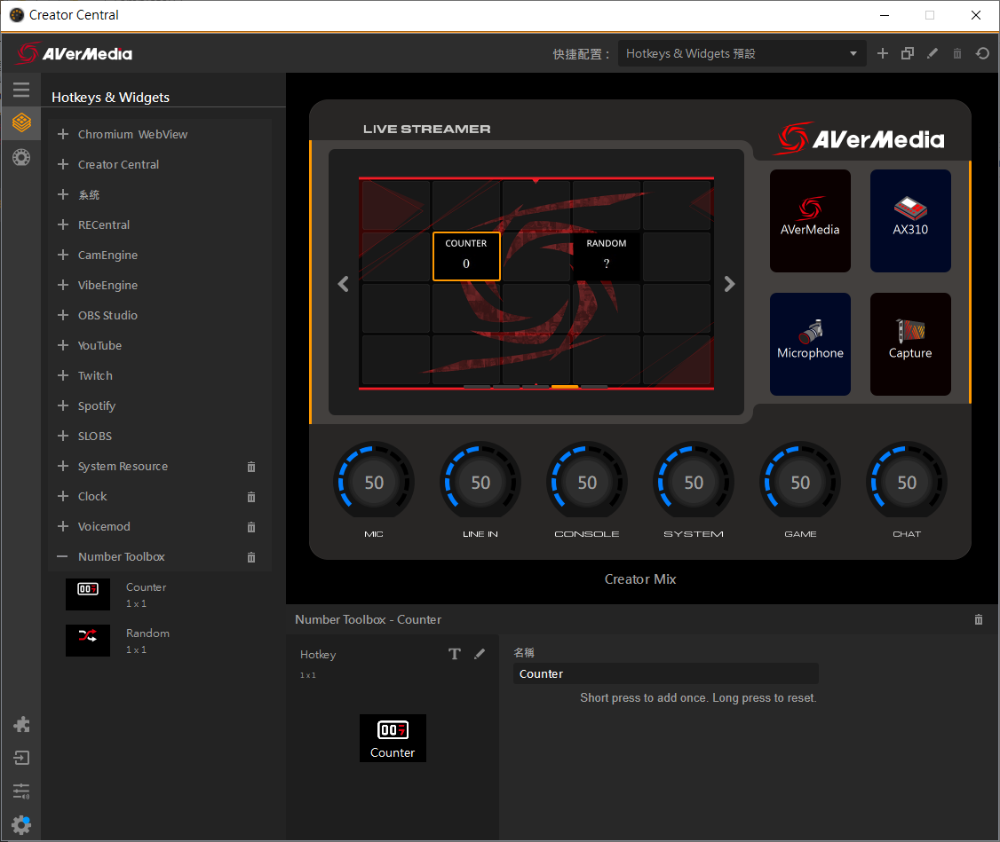
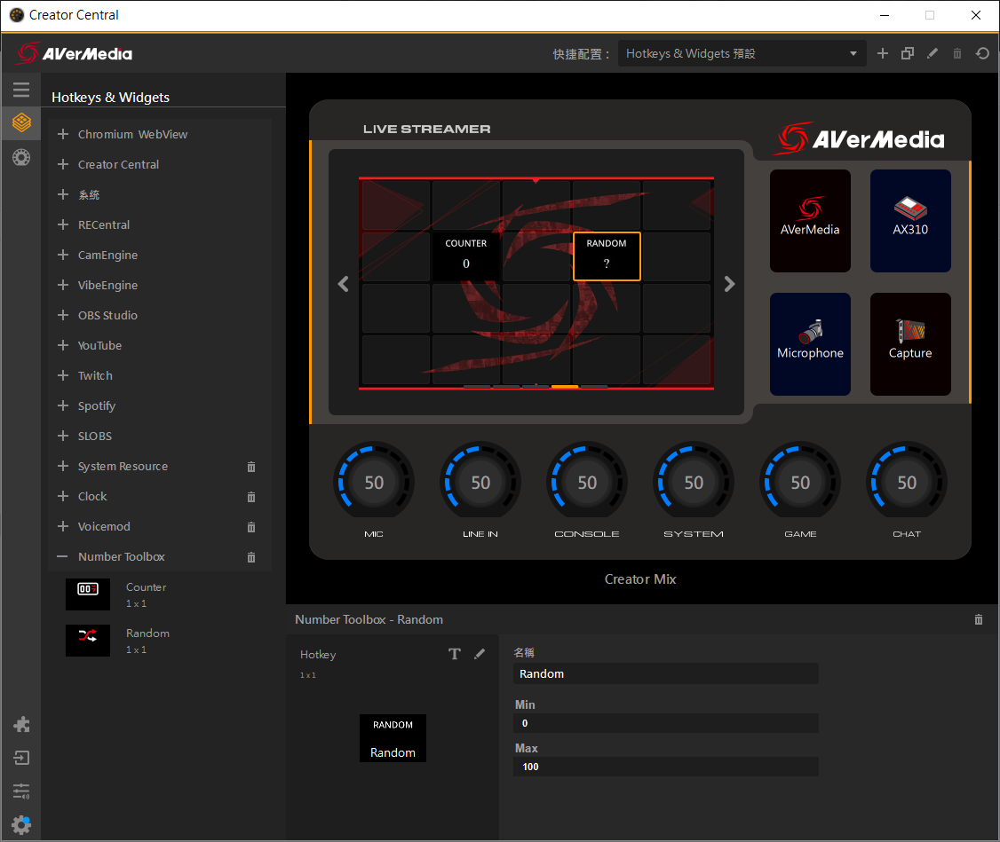
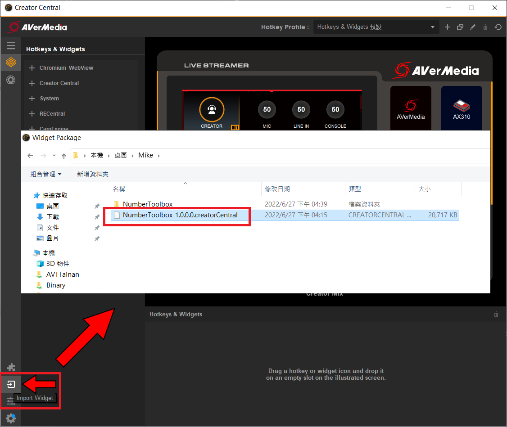
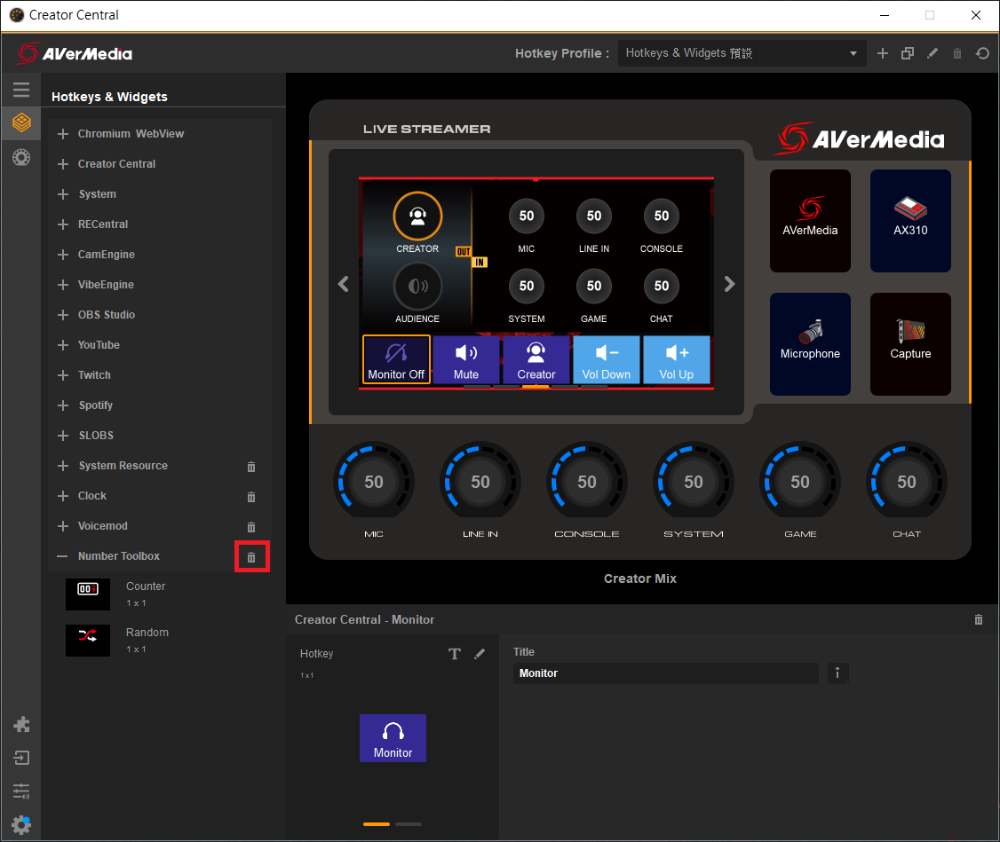

 
 

    
  

 
 

# Contents
- [English](#Description)
- [繁體中文](#描述)

# **Description**
This is a plugin with counting and random numbers. You can develop exclusive plugins through these two simple plugin examples.

# **Features**
* Code in Qt Creator
* Counter and random number generator
* Touch the panel to count and generate random numbers

# **Development Environment**
Comptabile to Win OS 10 / Mac OS 11.4  and above
Developed with Qt 6.2.4

# **Overview**
There are three main roles in this application.
1. Creator Central
2. Widget(Controller)
3. Property
This application demo shows how to implement counter and random widget using Qt.

When Creator Central starts Widget (Controller), Creator Central will send two parameters to Widget (Controller), namely Widget UUID and port. The two communicate through WebSocket. The follow-up commands need to include the Widget UUID information for identification, and the relevant definitions such as the packet format are explained in [The Overview of Creator Central SDK](https://github.com/AVerMedia-Technologies-Inc/CreatorCentralSDK).
The clock is created using Qt, and the content drawn on View is converted into a picture, and then converted into a Base64 String and sent to Creator Central.

# **Installation**
Install the compiled executable file into the Packages directory, as shown below

    
    

* [WinOS]
Packages installation path "C:/Users/＜YourName＞/AppData/Roaming/AVerMedia Creator Central/packages/xxxxxx/"。
* [MacOS]
Packages installation path "~/Applications Support/AVerMedia Creator Central/packages/xxxxxx/"。

# **Uninstallation**
Method 1. Using the Creator Central app

    

Method 2. Delete manually
* [WinOS]
Close the Creator Central app，go to "C:/Users/<YourName>/AppData/Roaming/AVerMedia Creator Central/packages/xxxxxx/" and delete the folder, and then open Creator Central again.
* [MacOS]
Close the Creator Central app，go to the "~/Applications Support/AVerMedia Creator Central/packages/xxxxxx/" directory and delete the folder, then open Creator Central again.

# **描述**
這是一個有計數和亂數的插件，你可以透過這兩個簡單的插件範例，來開發專屬插件

# **特徵**
* 用 Qt Creator 編寫程式碼
* 計數器和亂數產生器
* 點擊螢幕即可計數和亂數產生

# **開發環境**
適用於 Win OS 10 / Mac OS 11.4 以上版本
使用 Qt 6.2.4 版本開發

# **整體概要說明**
整個應用主要有三個角色
1. Creator Central
2. Widget(Controller)
3. Property
而本範例程式展示的是使用 Qt 如何實作計數和亂數產生器

當 Creator Central 啟動 Widget（Controller） 時， Creator Central 會派發兩個參數給 Widget（Controller） ，分別是 Widget UUID 以及 port。兩者間透過 WebSocket 進行溝通。後續的指令溝通都需要包含 Widget UUID 這資訊用以識別，封包格式等相關定義在 [The Overview of Creator Central SDK](https://github.com/AVerMedia-Technologies-Inc/CreatorCentralSDK) 有更進一步的說明。

# **安裝**
將編譯後執行檔安裝進 Packages 目錄，如下圖所示

    
    

* [WinOS]
Package 安裝路徑 "C:/Users/＜YourName＞/AppData/Roaming/AVerMedia Creator Central/packages/xxxxxx/"。
* [MacOS]
Package 安裝路徑 "~/Applications Support/AVerMedia Creator Central/packages/xxxxxx/"。

# **反安裝**
方法 1. 使用 Creator Central app

    

方法 2. 手動刪除
* [WinOS]
關閉 Creator Central ，到 "C:/Users/＜YourName＞/AppData/Roaming/AVerMedia Creator Central/packages/xxxxxx/" 目錄下把資料夾刪掉，再次打開 Creator Central 即可。
* [MacOS]
關閉 Creator Central ，到 "~/Applications Support/AVerMedia Creator Central/packages/xxxxxx/" 目錄下把資料夾刪掉，再次打開 Creator Central 即可。

